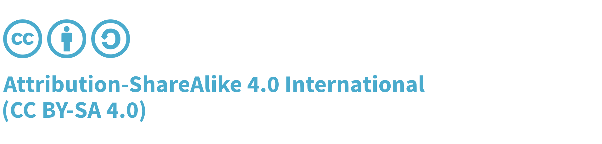

# Frontispiece

## About the Standard

The Software Component Verification Standard is a grouping of controls, separated by domain, which can be used by architects, developers, security, legal, and compliance to define, build, and verify the integrity of their software supply chain.

## Copyright and License

Copyright © 2020 The OWASP Foundation. 

This document is released under the [Creative Commons Attribution ShareAlike 4.0 license](https://creativecommons.org/licenses/by-sa/4.0/). For any reuse or distribution, you must make clear to others the license terms of this work.

Version 1.0.0-RC.1 (Public Preview), April 2020

## Project Leads

- Steve Springett

## Contributors and Reviewers

- Dave Russo
- Garret Fick
- JC Herz
- John Scott
- Mark Symons
- Pruthvi Nallapareddy
- Bryan Garcia

The Software Component Verification Standard is built upon the shoulders of those involved. The project is inspired by the OWASP Application Security Verification Standard and the work of their contributors.

If a credit is missing from the credit list above, please contact steve.springett@owasp.org or log a ticket at GitHub to be recognized in future updates. 

\newpage

